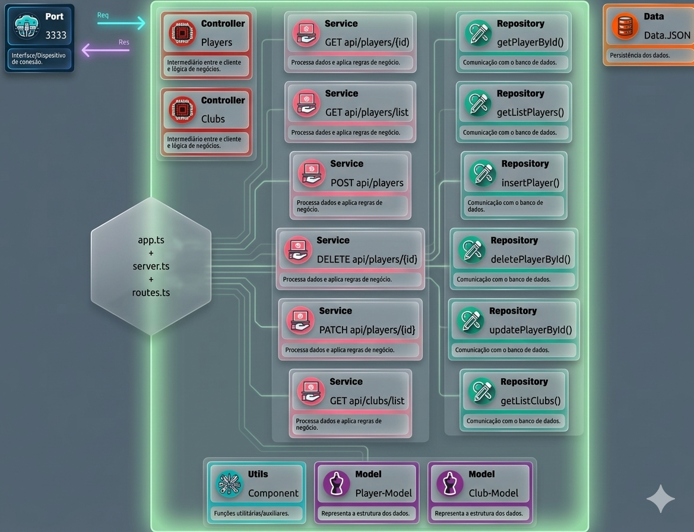

# ⚽ UEFA Champions League API - Temporada 2024/25



## 📌 Visão Geral

Esta API foi projetada para gerenciar e fornecer informações detalhadas sobre a **UEFA Champions League**, especificamente para a temporada **2024/25**. O projeto utiliza **Node.js** com **Express** e é totalmente tipado com **TypeScript**, garantindo segurança, escalabilidade e uma organização de código baseada em responsabilidades claras.

## 🛠️ Tecnologias e Ferramentas

- **Linguagem:** TypeScript para tipagem estática e robustez.
- **Framework:** Express.js para roteamento e gerenciamento de requisições.
- **Middleware:** CORS para controle de acesso e segurança.
- **Ambiente:** Node.js.

## ⚙️ Principais Funcionalidades

- **Gerenciamento de Clubes:** Consulta de times participantes da nova fase de liga.
- **Base de Jogadores:** Listagem de atletas com estatísticas detalhadas de performance.
- **Arquitetura em Camadas:** Separação rígida entre entrada de dados, lógica de negócio e persistência.
- **Resposta Padronizada:** Helpers para garantir que todas as respostas HTTP sigam o mesmo contrato.

## 🔗 Endpoints Base

Todas as rotas da API utilizam o prefixo `/api`. Por padrão (se `PORT=3333` no `.env`):

- **Jogadores:** `GET http://localhost:3333/api/players`
- **Clubes:** `GET http://localhost:3333/api/clubs`

## 📂 Organização do Código

```bash
/src
├── /controllers       # Interceptam requisições e formatam as respostas HTTP.
├── /data              # Persistência de dados em arquivos JSON.
├── /models            # Contratos de dados (interfaces) e tipos globais.
├── /repositories      # Camada de abstração para operações de leitura/escrita.
├── /services          # Onde a lógica de negócio e as regras são processadas.
├── /utils             # Funções utilitárias e tratadores de erros.
├── app.ts             # Instância principal e configuração do Express.
├── routes.ts          # Orquestração das rotas e endpoints.
└── server.ts          # Ponto de entrada que inicia o servidor.
```

## 🧠 Fluxo de Desenvolvimento

O projeto segue um fluxo de dados unidirecional para manter a manutenibilidade:

1. **Definição de Rotas:** Onde o endpoint é exposto.
2. **Controller:** Valida a entrada inicial e chama o serviço necessário.
3. **Service:** Executa as regras de negócio e decide quais dados buscar.
4. **Repository:** Acessa diretamente a fonte de dados (JSON) e retorna os objetos.

## 🚀 Como Executar

1. **Clone este repositório:**
   ```bash
   git clone https://github.com/maxmesquitashima/NodeExpressChampionsLeagueAPI.git
   ```
2. **Instale as dependências:**
   ```bash
   npm install
   ```
3. **Configuração:**
   Crie um arquivo `.env` na raiz e defina a variável `PORT` (ex: `PORT=3333`).
4. **Suba o servidor:**
   ```bash
   npm run start:dev
   ```
